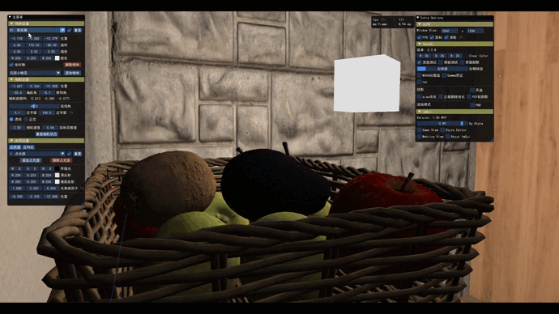
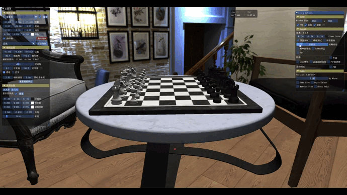
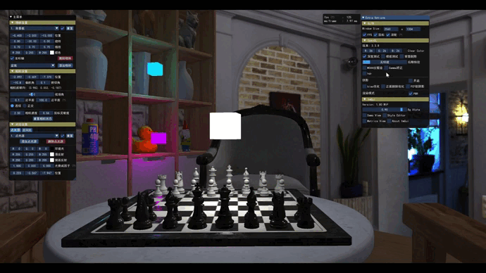
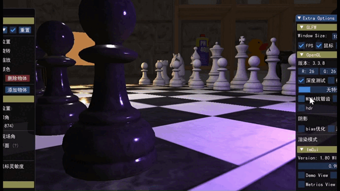

# SiriusEngine

这是一个基于C++编写，采用OpenGL提供的图形开发接口，配置ImGUI用户交互界面的实时硬件渲染器。

<ul>
<li>基础功能：基于GLFW的渲染窗口，摄像机平移与旋转，物体空间坐标系统变换矩阵，深度测试，点光源与定向光的光照系统</li>

<li>高交互性：提供预设的物体模型及光源，允许用户自由添加和删除场景内的模型和光源，允许修改模型和光源的颜色、位置、旋转角度等各项属性</li>

<li>光照渲染：提供Blinn-Phong的经验模型，GGX的PBR模型的光照渲染</li>

<li>阴影映射：实现定向光阴影，基于bias偏移和正面剔除优化的shadow mapping硬阴影，基于PCF的软阴影</li>

<li>图形优化：背面剔除、离屏MSAA抗锯齿、TBN切线空间下模型纹理凹凸效果</li>

<li>引擎优化：模型加载管理框架、材质复用管理框架、Mipmap、漫反射/镜面/法线/粗糙贴图载入与应用</li>

<li>场景功能：天空盒、后期特效(反相、灰度、模糊、锐化、边缘)、HDR画面亮度改善、Gamma光度矫正</li>
</ul>

## 动图展示

<ol>
<li> 模型编辑 </li>

<li> 光源编辑 </li>

<li> 后期特效 </li>

<li> PBR渲染 </li>

<li> 色调映射 </li>

<li> 阴影映射 </li>

<li> 抗锯齿 </li>

</ol>
